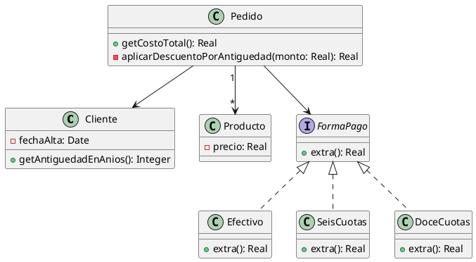

**Se tiene el siguiente modelo de un sistema de pedidos y la correspondiente implementación.**

```java
public class Pedido {
    private Cliente cliente;
    private List<Producto> productos;
    private String formaPago;

    public Pedido(Cliente cliente, List<Producto> productos, String formaPago) {
        if (!"efectivo".equals(formaPago) && !"6 cuotas".equals(formaPago) && !"12 cuotas".equals(formaPago)) {
            throw new Error("Forma de pago incorrecta");
        } 
        this.cliente = cliente;
        this.productos = productos;
        this.formaPago = formaPago;
    }
    public double getCostoTotal() {
	    double costoProductos = 0;
        for (Producto producto : this.productos) {
            costoProductos += producto.getPrecio();
        }
        double extraFormaPago = 0;
        if ("efectivo".equals(this.formaPago)) {
            extraFormaPago = 0;
        } else if ("6 cuotas".equals(this.formaPago)) {
            extraFormaPago = costoProductos * 0.2;
        } else if ("12 cuotas".equals(this.formaPago)) {
            extraFormaPago = costoProductos * 0.5;
        }
        int añosDesdeFechaAlta = Period.between(this.cliente.getFechaAlta(), LocalDate.now()).getYears();
        // Aplicar descuento del 10% si el cliente tiene más de 5 años de antiguedad
        if (añosDesdeFechaAlta > 5) {
            return (costoProductos + extraFormaPago) * 0.9;
        }
        return costoProductos + extraFormaPago;
    }
}
```

```java
public class Cliente {
	private LocalDate fechaAlta;
	
	public LocalDate getFechaAlta() {
		return this.fechaAlta;
	}
}
```

```java
public class Producto {
	private double precio;

	public double getPrecio() {
		return this.precio;
	}
}
```

>1. **Dado e l código anterior, aplique únicamente los siguientes refactoring:**
##### **Replace Loop with Pipeline (líneas 16 a 19)**

```java
public class Pedido {
	// ...
    public double getCostoTotal() {
	    double costoProductos = prodcutos.stream()
				    .mapToDouble(p -> p.getPrecio())
				    .sum()
        double extraFormaPago = 0;
        if ("efectivo".equals(this.formaPago)) {
            extraFormaPago = 0;
        } else if ("6 cuotas".equals(this.formaPago)) {
            extraFormaPago = costoProductos * 0.2;
        } else if ("12 cuotas".equals(this.formaPago)) {
            extraFormaPago = costoProductos * 0.5;
        }
        int añosDesdeFechaAlta = Period.between(this.cliente.getFechaAlta(), LocalDate.now()).getYears();
        // Aplicar descuento del 10% si el cliente tiene más de 5 años de antiguedad
        if (añosDesdeFechaAlta > 5) {
            return (costoProductos + extraFormaPago) * 0.9;
        }
        return costoProductos + extraFormaPago;
    }
}
```

##### **Replace Conditional with Polymorphism (líneas 21 a 27)**

```java
public class Pedido {
	private FormaPago formaPago;
	// ...
    public double getCostoTotal() {
	    double costoProductos = prodcutos.stream()
				    .mapToDouble(p -> p.getPrecio())
				    .sum()
        double extraFormaPago = costoProductos * this.formaPago.extra();
        int añosDesdeFechaAlta = Period.between(this.cliente.getFechaAlta(), LocalDate.now()).getYears();
        // Aplicar descuento del 10% si el cliente tiene más de 5 años de antiguedad
        if (añosDesdeFechaAlta > 5) {
            return (costoProductos + extraFormaPago) * 0.9;
        }
        return costoProductos + extraFormaPago;
    }
}
```

```java
public interaface FormaPago {
	public double extra(); 
}

public class Efectivo implements FormaPago {
	public double extra(){
		return 0;
	}
}

public class SeisCuotas implements FormaPago {
	public double extra(){
		return 0.2;
	}
}

public class DoceCuotas implements FormaPago {
	public double extra(){
		return 0.5;
	}
}
```

##### **Extract method y move method (línea 28)**

```java
public class Cliente {
    private LocalDate fechaAlta;
    
    public LocalDate getFechaAlta() {
        return this.fechaAlta;
    }

    public int getAntiguedadEnAnios() {
        return Period.between(this.fechaAlta, LocalDate.now()).getYears();
    }
}
```

##### **Extract method y replace temp with query (líneas 28 a 33)**

```java
public class Pedido {
    private Cliente cliente;
    private FormaPago formaPago;
    private List<Producto> productos;

    public double getCostoTotal() {
        double costoProductos = productos.stream()
                .mapToDouble(Producto::getPrecio)
                .sum();

        double extraFormaPago = this.formaPago.calcularRecargo(costoProductos);
        double subtotal = costoProductos + extraFormaPago;

        return aplicarDescuentoPorAntiguedad(subtotal);
    }

    private double aplicarDescuentoPorAntiguedad(double monto) {
	    return (this.cliente.getAntiguedadEnAnios() > 5)? monto * 0.9 : monto;
    }
}
```

> 2. **Realice el diagrama de clases del código refactorizado.**


