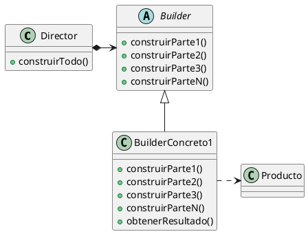

# ¿Por que usamos el Builder?
Lo usamos cuando tenemos siempre el mismo paso a paso, pero el resultado puede variar mucho. La secuencia de armado es la misma, solo me cambia el objeto final que quiero obtener.

La idea es que exista un Director que no sepa como se hacen las cosas pero sabe que hacer y en que orden; por otro lado tenemos el Builder que sabe que hacer pero no sabe cuando hacerlo ni en que orden. El director maneja al builder
# ¿Cuando usamos el Builder?
- **Algoritmo de creacion independiente de las partes y de como se ensamblan:** El codigo de construccion (builder) no deberia saber con que piezas ni en que orden se arma la totalidad del objeto. El director da ordenes a ciegas basicamente

- **Proceso de construccion da diferentes representaciones del producto:** El mismo proceso de armado debe poder dar diferentes resultados

Usa builder cuando *como construis algo* es fijo y reutilizable, pero *que construis*  puede variar 
# Componentes
- **Director:** Basicamente le da las ordenes al builder. El metodo `construir()` suele ser void, ya que solo le pasan un Builder por parametro, llama a todo lo que tiene que llamar del builder (ejemplo: agregar pan, agregar carne, agregar aderezo) sin saber como se hace y sin almacenar nada, tampoco lo devuelve, solo lo arma adentro del builder

- **Builder:** El builder sabe todos los metodos de crear partes pero no sabe en que orden llamarlos. Esta parte tiene que decir a los builder concretos que tienen que saber armar y tambien al director le generaliza cualquier cosa que llegue para dirigir

- **Builder Concreto:** Aca se determina realmente que se va a construir y que hace cada metodo, por ejemplo, aca se sabe si se esta armando un sanguche y que va a hacer el metodo `agregarPan()`. Podria ser el caso de que con el mismo director se armen hamburguesas, por lo que en otro builder concreto tendriamos la referencia a la hamburguesa y el metodo `agregarPan()` haria otra cosa y el resultado final seria otro, con la mimsa serie de pasos. Aca estaria el metodo `obtenerResultado()`

- **Producto:** Es lo que va armar una combinacion entre builder y director, puede haber muchos y no tienen por que compartir interfaz

# Consecuencias
1. **Cambiar como se representa un producto por dentro sin tocar nada:** La idea seria que como el director no sabe que esta armando, si se busca una representacion interna de un producto solo hace falta crear otro builder

2. **Aislar el codigo de la construccion:** Toda la logica de como se crea y arma queda adentro del builder concreto, hasta distintos directores pueden usar el mismo builder para armar distintos productos con las mismas piezas (el mismo builder concreto) 

3. **Control sobre construccion:**  Como no te da un objeto de un saque (como por ejemplo el factory) sino que lo construye de a poco, da mas control sobre el proceso y por lo tanto tambien del resultado final. Por ejemplo puedo tomar decisiones en el director de que partes agregar, agregarlas solo si pasa x cosa, etc. Da un control mas fino

# Implementacion
Hay una clase Builder abstracta, la cual define una operacion por cada parte que se puede construir (un metodo) vacia. Despues cada builder concreto elije cuales quiere implementar

En la parte del director, lo mas comun es que vaya un paso abajo del otro, devolviendo todos los metodos del builder `void`, pero se puede complejizar y que por ejemplo, para construir un pasillo necesite las dos habitaciones. En ese caso el builder me tendria que ir devolviendo las cosas

La parte de los productos no es obligatorio que tengan una interfaz comun, este patron permite crear cosas muy distintas por lo que una implementacion basica permite no especificar un apdre comun para todo lo creado

### Ejemplo
El director es asi
```java
public class Director{
	public void construir(Builder b){
		b.agregarPan();
		b.agregarAderezo();
		b.agregarCarne();
		b.agregarCondimentos();
	}
}
```
Aca se nota como el director solo dirige, no crea ni devuelve nada

El builder es asi (builder abstracto, todavia no sabe que devuelve)
```java
public abstract class Builder{
	public void agregarPan(){}
	public void agregarAderezo(){}
	public void agregarCarne(){}
	public void agregarCondimentos();
}
```
Aca tambien pueden declararse como abstractos o como interfaz, depende el problema. Todas son soluciones validas

Un builder concreto seria esto
```java
public class HamburguesaBuilder{
	private Hamburguesa hamb;
	
	@Override
	public void agregarPan(){
		hamb.agregarIngrediente("Pan de papa");
	}
	
	@Override
	public void agregarAderezo(){
		hamb.agregarIngrediente("Mayonesa");
	}
	
	@Override
	public void agregarCarne(){
		hamb.agregarIngrediente("Paty");
	}
	
	@Override
	public void agregarCondimento(){
		hamb.agregarIngrediente("Sal");
	}
	
	//Este metodo siempre tiene que estar definido, no lo puedo definir en la clase padre porque otro concrete builder podria devolver un sanguche, asi que cambiaria la firma
	public Hamburguesa obtenerResultado(){
		return hamb;
	}
}
```

Entonces la secuencia, armando todo, quedaria asi:
```java
public static void main(String[] args){
	Director dir = new Director();
	HamburguesaBuilder hb = new HamburguesaBuilder();
	
	dir.construir(b);
	//En este punto, el builder esta cargado con la hamburguesa con todos sus ingredientes, ahora tengo que pedirselo
	Hamburguesa resultado = hb.obtenerResultado();
}
```