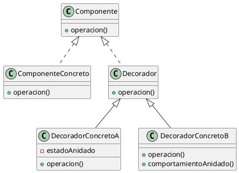

# ¿Por que usamos el decorator?
El decorator se usa para **agregar responsabilidades a un objeto de forma dinamica**, envolviendo a un objeto adentro de otro. La idea es que tengo a alguien envuelto y a mi mismo, entonces le pido el comportamiento a lo que yo envuelvo y le agrego algo, entonces cuando alguien me envuelva, le voy a devolver lo que yo envolvi, lo mio y el le va a agregar lo de el.

Si yo por ejemplo tengo un `Carpeta` y quiero comprimirla y/o encriptarla, deberia crear las clases `CarpetaComprimida`, `CarpetaEncriptada` y `CarpetaComprimidaEncriptada`, si a esto se le agregan mas variantes se me va todo al pasto. Para esto, creo los decoradores `DecoradorComprimido` y `DecoradorEncriptado` (Uno por cada funcionalidad, me ahorro crear uno por cada combinacion posible) 

# ¿Cuando usamos el decorator?
- **Agregar objetos individuales de forma dinamica y transparente:** Evito cambiar toda la funcionalidad de la clase, solo agarro un objeto instanciado y le doy una nueva funcionalidad en tiempo de ejecucion

- **Responsabilidades que pueden ser retiradas:** Cuando agregas cosas por herencia quedan fijas y no se pueden cambiar, no se puede desheredar un objeto. En cambio con el decorator si se puede desenvolver un objeto, se puede actualizar todo eso de manera dinamica

- **Herencia no viable:** El uso mas importante, si tenes varias caracteristicas, se termina creando una clase por cada combinacion, esto genera una **explosion inmanejable de subclases**, es decir hay una banda y cada vez que quiera agregar voy a tener una banda$^2$ 

# Componentes
- **Componente:** Aca se da eso de que el usuario no sabe si esta hablando con un decorador o con un objeto posta, esta interfaz la deben tener tanto el objeto real como los decoradores

- **Componente Concreto:** Este es el objeto posta, este no envuelve a nadie y es el que tiene toda la informacion base, aunque los decoradores de despues pueden tener estado interno, este tiene la informacion basica que no puede sacarse

- **Decorador:** Es la clase abstracta del envoltorio basicamente. Su laburo es responder a lo mismo que responde el objeto original para que no se note la diferencia de si sos un decorador o el objeto original. Define un componente al cual va a envolver para que todos los decoradores envuelvan a alguien, ya sea otro decorador o el objeto posta. 

- **Decorador Concreto:** Son las funcionalidades especificas que se agregan, extienden del `Decorador`, lo que hacen es pedirle a lo que envuelve que haga su trabajo y agregarle algo mas

# Consecuencias
## Ventajas
- **Mas flexible que la herencia:** Con decoradores agregás o sacás funcionalidad en tiempo de ejecución, solo envolviendo. Tambien si queres agregar una funcionalidad dos veces lo envolves dos veces y listo

- **Evitas clases enormes:** En vez de meter cada posible funcionalidad en una clase enorme, dejas una clase basica y vas generando decoradores
## Desventajas
- **El decorador no es lo mismo que el componente concreto:** Basicamente para el sistema tiene otra identidad asi que si comparas con `==` va a dar falso.

- **Muchos objetos chiquitos y parecidos:** Terminas con un monton de objetos que solo cambian en como estan encadenados entre si, se vuelve dificil de seguir el codigo
# Implementacion
1. **Misma interfaz entre decorador y componente concreto:** El decorador tiene que tener la misma interfaz que el componente concreto ya que va a hacerse pasar por el

2. **Se puede omitir la clase abstracta decorador:** Basicamente si solo hace falta implementar una sola responsabilidad no hace falta crear la clase abstracta

3. **Las clases componentes tienen que ser livianas:** Basicamente que la interface de arriba de todo no guarde cosas innecesarias, que solo se enfoque en definir la interfaz y no en guardar datos. Si le metes muchas cosas todos los decoradores se vuelven pesados

4. **No lo uses para cambiar la clase base:** Si queres cambiar como se comporta internamente usa un `Strategy`. El decorador tiene una clase componente liviana para que envolver sea barato. El strategy tiene una clase componente pesada, para eso que el componente le delegue cosas al strategy en ese caso

