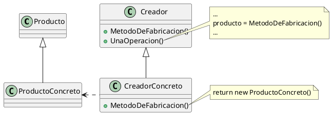

# ¿Por que usamos el factory method?
Busca resovler el problema de que una clase no sepa que instanciar en un momento determinado. Hacerla especifica para una subclase nos sacaria la reusabilidad del codigo. Si tengo un editor general como puedo evitar preguntar si estoy hablando de un txt, de un pdf o de un png.

El factory puede pensarse como un hook mas de un template el cual en vez de hacer una operacion o algo asi, devuelve un objeto creado. Este conjunto de objetos que las diferentes implementaciones de factory puedenc crear **deben compartir interface**.
# ¿Cuando usamos el factory method?
- **No sabemos el objeto que tenemos que crear:** Nuestro codigo sirve para muchas cosas, por ejemplo puedo generalizar un vehiculo pero no puedo generalizar la forma de propulsion, una bici tiene pedales, un auto un motor y asi. Lo que hago es delegar la creacion de la propulsion a el factory method

- **Darle poder de decision a las subclases:** La idea es que cada subclase pueda elegir con que objeto trabajar, por ahi en un restaurante sirven el menu del dia pero aca le damos poder de elegir ese plato del dia a cada subclase, aunque sean platos distintos todos los restaurantes despues van a hacer `plato.servir()`

- **Centralizar los helper:** Basicamente le sacas complejidad a tu codigo delegando estas creaciones a clases helper, lo unico que van harian seria abstraer a la clase grande de la logica de creacion. Centralizamos todo esto en un metodo de fabricacion

*Nota: En el dibujo, el **Factory Method** como tal seria el  `MetodoDeFabricacion()`*
# Componentes
- **Producto:**  Es la interfaz abstracta de los productos que va a creer el factory method. Es la generalizacion de todo lo que puede crear el factory

- **Producto Concreto:** Implementacion concreta de producto, es lo que realmente se instancia y devuelve el factory en tiempo de ejecucion

- **Creador:** Es donde vive el factory method, aca se declara el factory ya sea abstracto o un metodo concreto por default. Por ejemplo en un editor de texto podria crearse por default un txt pero otras implementaciones del factroy podria trabajarse sobre un pdf. *El creador no solo sirve para crear productos, suele tener comportamiento y reglas de negocio propias, el factory es solo un punto de extension*

- **Creador Concreto:** Subclase que redefine el metodo del factory para devolver un producto concreto. Toda la logica del creador sigue funcionando igual pero ahora produce un producto concreto

*Nota: El factory method es el metodo que define el Creador, no el Creador en si mismo*
# Consecuencias
- **Elimina las clases concretas:** Ya no hace falta atar una clase que puede ser muy compleja con muchas funcionalidades a un solo tipo de producto concreto. Se generaliza ese producto y se usa como un producto generico delegando toda la creacion a los Creadores Concretos

- **Hooks para las subclases:** Si o si estas clases tienen que heredar de Creador, en algunos casos lo iba a hacer de cualquier manera asi que no estas mal pero en otros, pero sino se esta introduciendo una nueva jerarquia solo para crear un producto

- **Metodo de fabricacion como punto de extension:** Crear objetos con un metodo antes que con new es mas flexible a cambios, se le permite a una subclase solo redefinir ese punto de extension especifico, si este no esta habria que reeimplementar todo el metodo y nos podria llevar a tener codigo duplicado
# Implementacion
- **Dos variantes:** El creador define el abstracto, osea que el metodo no esta implementado y todas las subclases estan obligadas a implementarlo; y el normal que define un producto concreto default y deja el punto de extension abierto a las subclases

- **Parametros:** Los factory pueden recibir parametros para saber que crear pero te genera switch statement

### Ejemplo
Tengo una clase concreta `Vehiculo`, todos los vehiculos tienen un tipo de `Propulsor` distinta, por ejemplo las bicicletas tienen `Pedal`, los autos tienen `Motor` y los aviones `Turbina`. En este ejemplo todos comparten la interfaz `Propulsor` que tiene el metodo `encender()` y `avanzar()`

Yo voy a definir en mi clase `Vehiculo` mi metodo factory, este se va a llamar `crearPropulsion(): Propulsor`, en este caso en mi metodo avanzar yo haria algo del estilo

```java
public abstract class Vehiculo{
	...
	
	protected abstract Propulsor crearPropulsion();
	
	public void moverme(){
		Propulsor p = this.crearPropulsion();
		p.encender();
		p.avanzar();
	}
}
```
Basicamente es un template ya que defino el hook obligatorio que va a completar cada clase