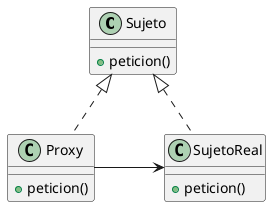

# ¿Por que usamos el proxy?
Lo usamos para evitar crear cosas costosas hasta que sean realmente necesarias. El proxy funciona como sustituto del objeto real y solo lo crea cuando hace falta usarlo. La idea es que el proxy sepa responder a lo mismo que el objeto real, le hablas al proxy como si hablaras con el real. Cuando le pedis algo importante por primera vez lo crea, a partir de ahi las siguientes llamadas las reenvia al objeto real

Algunas cosas las puede responder el proxy mismo, los datos baratos los puede guardar por si mismo para no crear un objeto super pesado para obtener un entero nada mas
# ¿Cuando usamos el proxy?
Hay varios casos donde usamos **proxy**

- **Proxy remoto:** Basicamente lo que hace es que cuando tenes algo en otro lado, por ejemplo la nube, en vez de ensuciar tu codigo con esa conexion hablas con el proxy como si fuera un objeto local y este se encarga de la conexion, basicamente hace de embajador

- **Proxy virtual:** Retrasa la creacion de objetos pesados o costosos hasta el momento exacto donde el sistema los necesita. Basicamente si tenes un doc con 50 fotos, cada foto es un proxy que solo carga la imagen cuando el usario la tiene en pantalla

- **Proxy de Proteccion:** Hace de patovica entre el objeto real y el usuario, fijandose si por ejemplo tiene permisos para hacer lo que quiere hacer. Antes de modificar un objeto real, se fija que el usuario este autorizado para hacerlo

- **Referencia inteligente:** Basicamente es un puntero que aparte de apuntar a la direccion de memoria del objeto, hace trabajos extras, por ejemplo de limpieza o mantenimiento 
# Componentes
- **Sujeto:** Es lo que dice como deben comportarse y que tienen que saber hacer tanto el proxy (representante) como el objeto real. Busca hacer que sea lo mismo hablarle al proxy o al objeto real en cuanto a que metodos se llaman

- **Sujeto Real:** Es el objeto posta, el que tiene la informacion real. Queremos proteger este porque puede tener datos sensibles o puede ser muy pesado

- **Proxy:** Es con el que interactua el sistema, el que conoce donde esta el sujeto real (objeto posta) y decide si te deja usarlo o no
# Consecuencias
El proxy funciona agregando un intermediario entre el usuario y el objeto real. Dependiendo el tipo de proxy hace cosas distintas

- **Proxy remoto:** Oculta por completo el hecho de que el objeto real está en otra computadora o servidor.
- **Proxy virtual:** Retrasa la creación de objetos que consumen mucha memoria hasta el segundo exacto en que te hacen falta ("por encargo").
- **Proxy de proteccion:** Aprovechan que están en el medio para hacer tareas de seguridad cada vez que alguien quiere usar el objeto.

Hay una optimizacion del proxy que se llama **Copy-on-Write** que lo que hace es, ante por ejemplo, 5 peticiones de un objeto pesadisimo, les da a todos un proxy que apunta al mismo objeto para no crear 5 copias solo para mirarlo o usarlo. Lo que hace es llevar una cuenta de cuantas personas estan usando la copia, y cuando alguien quiere modificarlo, le da otra copia para no cambiarle el objeto a los otros 4, en ese momento decrementa en uno el contador de la gente que lo esta usando. **Solo se paga el costo de crearlo cuando alguien necesita cambiarlo**
# Implementacion
- **Actuar como puntero inteligente:** Basicamente es configurar el proxy para que actue realmente como un puntero. Esto se puede hacer en por ejemplo C++,  se modifica como funciona el operador de acceso `->` , haciendo esto el proxy intercepta cualquier llamada al objeto y hace su trabajo extra

- **Atrapar mensajes no entendidos:** Es algo de smalltalk, basicamente es aprovecharse de que cuando no entiende algo tira una alerta `doesNotUnderstand` y el proxy se crea vacio, cuando se tira esa alerta se crea el objeto real y ahi empieza a entender

- **Proxy generico, salvo cuando crea:** Basicamente lo que pasa aca es que si tenes la clase abstracta documento y 3 que heredan eso, en los proxys de proteccion no te interesa cual de todos es el documento ya que lo recibis ya creado. En cambio en el proxy virtual, como se encarga de crear, debe saber obligatoriamente que tiene que crear
