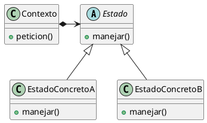

# ¿Por que usamos el state?
Lo usamos para cuando un objeto tiene que actuar distinto dependiendo de su estado interno. Buscamos delegar que todo lo que dependa de un estado lo haga el mismo estado. Hacer esto nos ahorra una banda de `if/else`, y nos deja mas claro cuando se transiciona de un estado a otro.

La idea es que las responsabilidades de los estados sea realizar las operaciones que difieren entre estados, osea generar su implementacion propia de cierta accion y lo mas importante es que **los estados son los encargados de cambiar al contexto de estado**, esto lo diferencia un monton del strategy por ejemplo, donde las estrategias no se conocen entre si y no se cambian a no ser que el cliente lo pida
# ¿Cuando usamos el state?
- El comportamiento de un objeto depende de su estado, por ejemplo si anotas a gente a una clase, si la clase aun no esta llena se anota en la lista normal, y si esta llena se anota en lista de espera

- Hay condicionales grandes que se repiten en el codigo y representan estados, y cada rama del condicional se comporta distinto dependiendo de un estado, el cual el mismo condicional puede cambiar
# Componentes
- **Contexto:** Representa el objeto que tiene comportamiento variando entre estados. Basicamente el que va a tener la instancia de estado

- **Estado:** La abstraccion de un estado, va tener un metodo por cada accion del contexto que haga distintas cosas dependiendo al estado

- **Estado concreto:** Aca va cada estado concreto que implementa los metodos de estado y tienen la logica de cada estado particular
# Consecuencias
**Resumen:** Ganas estructura, flexibilidad y transiciones claras a cambio de mas clases. Si los estados no guardan info propia se pueden reutilizar instancias

- **Agrupa y separa el comportamiento por estado:** Junta todo el comportamiento de un estado en una clase, asi que definir nuevos estados solo es crear mas clases

- **Transiciones explicitas:** Es mas facil hacer un seguimiento de un estado, saber a cuales puede irse cada uno y de que manera viendo todos los metodos de una clase (Un estado nunca va a pasar de uno a otro de una si no lo hace el mismo)

 - **Estados compartidos:** Si no se guarda info propio puede existir una sola instancia de estado. Basicamente un Singleton donde varios estados comparten la misma instancia de Estado 
# Implementacion
- **Quien define los cambios de estado?** Lo mejor seria que los estados se cambien entre ellos ya que es mas claro, la contra de esto es que se genera dependencia entre estados concretos

- **Como se hace este cambio?** Hay dos maneras, dejando un metodo package-private (en Java se hace no definiendole una privacidad) en el contexto que sea `void cambiarEstado(Estado e)` cuando un hay una transicion el estado actual hace un `contexto.cambiarEstado(new Lleno())` por ejemplo.

	- Si bien esa es la manera mas normal y de la catedra, hay una alternativa que esta buena que las operaciones del estado concreto retornen estados. Esto generaria que ante cada operacion un estado pueda elegir entre devolverse a si mismo o devolver un nuevo estado. En el contexto esto se implementaria haciendo 
		- `this.estado = this.estado.anotarAClase(listaInscriptos)`
	- Entonces si la clase todavia tiene cupo se retorna a si mismo, en cambio si se lleno retorna un estado `LLeno()`

- **De donde saco los datos que necesito:** Es poco comun que el state tenga conocimiento aunque puede pasar. La idea es que sean estados volatiles, aveces si es poca la informacion que se necesita se puede pasar los datos por parametro, u otras veces tiene que usar mucha info o mandarle mensajes al contexto asi que el contexto entero se pasa por parametro, se analiza la situacion particular